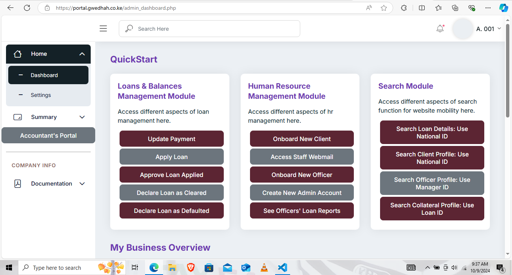

# Admin Dashboard Overview

As an admin, your dashboard gives you full control over the Loan Management System. Here's a summary of what you can do:

<figure><figcaption></figcaption></figure>

**1. Loans & Balances Management Module**

* **Update Payment**: Record a payment made towards a loan.
* **Apply Loan**: Submit a new loan application on behalf of a client.
* **Approve Loan Applied**: Review and approve loans submitted for approval.
* **Declare Loan as Cleared**: Mark a loan as fully repaid.
* **Declare Loan as Defaulted**: Mark a loan as defaulted if no payments are made within a certain period.

**2. Human Resource Management Module**

* **Onboard New Client**: Add new clients into the system.
* **Access Staff Webmail**: Use the system to access internal staff email.
* **Onboard New Officer**: Register new loan officers (managers) into the system.
* **Create New Admin Account**: Add new administrators to the system.
* **See Officers' Loan Reports**: View detailed reports of loans managed by specific officers.

**3. Search Module**

* **Search Loan Details (Using National ID)**: Find loan information using a client's national ID.
* **Search Client Profile (Using National ID)**: Look up a client's profile using their national ID.
* **Search Officer Profile (Using Manager ID)**: Find details of a loan officer using their ID.
* **Search Collateral Profile (Using Loan ID)**: Retrieve information about the collateral associated with a specific loan.

**4. Business Overview**

This section provides you with a comprehensive overview of key metrics:

* **Total No. of Loans Disbursed**: The total number of loans issued since the system's inception.
* **Total No. of Clients in Clientbook**: The total number of clients registered in the system.
* **Total Accrued Interest**: The cumulative interest earned on all loans disbursed.
* **Total Payments Received**: The total sum of loan payments received to date.

**5. Today's Business Activity**

This section shows real-time data for today's activities:

* **No. of Loans Disbursed Today**: The number of loans issued today.
* **Loan Amounts Disbursed Today**: The total amount disbursed today.
* **Total Interest Earned Today**: The total interest earned from disbursed loans today.
* **Total Payments Received Today**: The total payments collected from clients today.

**6. Transactions Data Table**

This table shows recent transactions, including:

* **Client Name**: The name of the client making the transaction.
* **Loan ID**: The loan associated with the transaction.
* **Transaction Date**: When the payment was received.
* **Received Payment**: The payment amount.
* **Transaction Reference**: The reference number for the payment.

Each of these tools helps you maintain full control over the loan management system.
