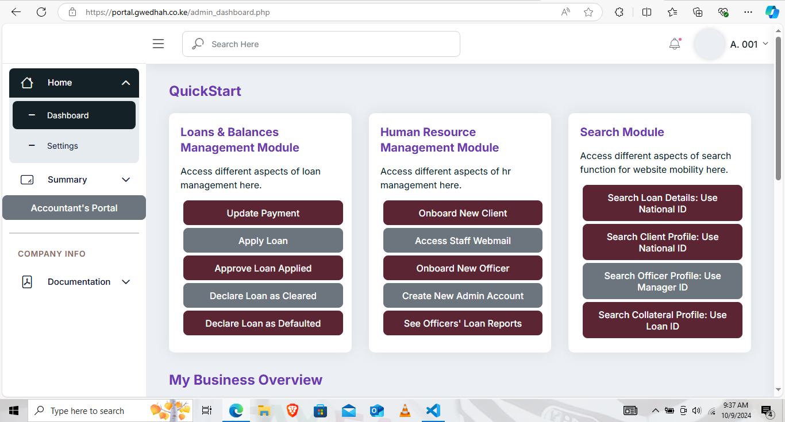

# Client Dashboard Overview

As a **client** of the loan management system, once you log in, you will be able to access several key features and information directly from your dashboard. Below is an overview of what you can expect to see and do on your dashboard:

<figure><figcaption></figcaption></figure>

**1. View Your Loan Summaries**

* **Active Loans**: You will be able to see all your active loans. For each loan, you'll find the following details:
  * **Loan Balance**: The remaining balance on your loan.
  * **Loan Installments**: The number of installments you've paid and the number still remaining.
  * **Accrued Interest**: The total interest that has accumulated on your loan so far.
  * **Next Payment Date**: The date your next loan payment is due.
  * **Next Payment Amount**: The exact amount you need to pay for the upcoming installment.
  * **Periods Passed/Remaining**: The number of payment periods you've completed and the ones that remain.
  * **Clear Today Amount**: The total amount required to fully clear your loan if you want to make a one-time payment today.
  * **Total Payments**: The cumulative amount you’ve paid on the loan so far.

**2. Loan Details & Payment History**

* For each loan, you can view the **most recent payments** you’ve made, up to the last 5 payments. This section provides details such as:
  * **Payment Date**: The date when the payment was made.
  * **Payment Amount**: How much was paid in each installment.
  * **Remaining Balance**: What your loan balance was after the payment.

**3. Manage Your Profile Information**

* **Personal Info**: You can view and update your personal details, such as your email address, phone number, and other contact information.
* **KYC Documents**: Ensure your Know Your Customer (KYC) documents are up to date. You may be prompted to upload your ID or passport, and other verification documents.
* **Next of Kin**: Add or update the contact information of your next of kin for reference purposes.

**4. Payment Options**

* **Upcoming Payments**: You will see the details of your upcoming payments, allowing you to plan ahead and avoid missed payments.
* **Make a Payment**: If integrated with a payment gateway (e.g., M-Pesa), you will be able to initiate a payment directly from the dashboard.
* **Early Loan Settlement**: If you wish to settle your loan early, the system will calculate the exact amount required to clear your balance immediately.

**5. Notifications & Alerts**

* Stay up to date with system notifications, such as reminders for upcoming payments, or updates on your loan status.
* You may also receive alerts if your loan status changes, such as when it transitions from "Active" to "Completed."

***

This client dashboard ensures that you have full visibility and control over your loan details, payment history, and upcoming obligations. If you need assistance with any feature, the support team is available to help you through the contact information provided on your dashboard.
