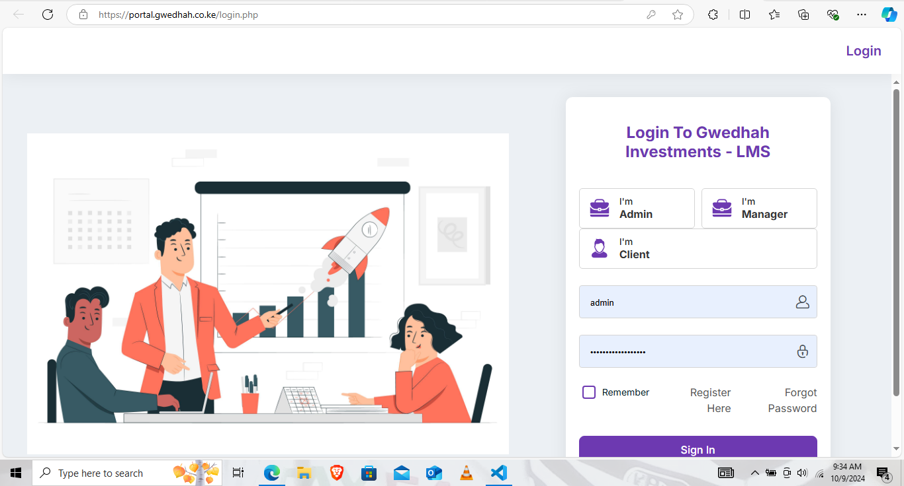

# Quickstart: Loan Management System User Manual

<figure><figcaption></figcaption></figure>

**1. Introduction to User Roles**

The Loan Management System (LMS) allows different users to manage and track loans in the system based on their roles. There are three types of users:

1. **Client**:
   * **Purpose**: View your loan details, including balances and payment history.
   * **Access**: You can only see information related to your own loans.
2. **Manager/Loan Officer**:
   * **Purpose**: Manage clients, onboard new clients, apply for loans on their behalf, and track transactions such as loan payments.
   * **Access**: Can manage multiple clients, process loans, and keep track of financial activities for clients.
3. **Admin**:
   * **Purpose**: Oversee the entire system, onboard new managers, monitor all activities (client and manager), and generate reports.
   * **Access**: Full system control, including the ability to add new managers, view all loan transactions, client activity, and performance reports for profitability monitoring.

***


In the next steps, you will learn how to log into the system and view the different dashboards.

